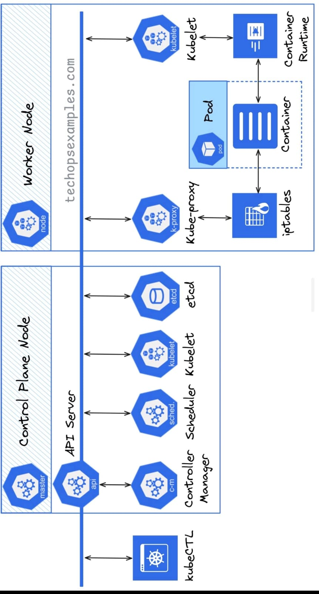

# 📘 Kubernetes Day 1 - Introduction to Kubernetes & Architecture

---

## 🎯 Objectives

Welcome to Day 1 of our Kubernetes training journey!  
By the end of today’s session, you'll be able to:

- Understand **what Kubernetes is** and why it's important
- Know the core **components of Kubernetes architecture**
- Learn about **control plane vs worker node**
- Run basic **kubectl commands**
- Understand the difference between **Docker and Kubernetes**
- Get hands-on using **KillerKoda playground**

---

## 🧠 What is Kubernetes?

> Kubernetes (aka K8s) is an open-source container orchestration platform for **automating deployment, scaling, and management** of containerized applications.

### 🚀 Why Kubernetes?

- Automatic scheduling of containers
- Self-healing (auto-restart, reschedule, replace)
- Scaling (manual and auto)
- Rollbacks and rolling updates
- Load balancing between pods
- Infrastructure abstraction

---
SS
## 🏗️ Kubernetes Architecture Overview



### 🔷 Control Plane Components

| Component        | Role                                        |
|------------------|---------------------------------------------|
| `kube-apiserver` | Entry point for all commands (REST API)     |
| `etcd`           | Distributed key-value store (K8s DB)        |
| `kube-scheduler` | Decides which node a pod goes to            |
| `kube-controller-manager` | Runs core controllers (Replica, Node, etc.) |
| `cloud-controller-manager` | Integrates with cloud providers   |


---

### 🟩 Worker Node Components

| Component     | Role                                         |
|---------------|----------------------------------------------|
| `kubelet`     | Talks to control plane, runs pods            |
| `kube-proxy`  | Handles networking, routing, load balancing  |
| `Container Runtime` | E.g., containerd, Docker, manages containers |

---

### 🔁 High-Level Workflow

```text
kubectl -> API Server -> Scheduler -> Kubelet -> Pod Running
````

---

## 🔧 kubectl - Basic Commands

```bash
kubectl version               # Check client and server versions
kubectl cluster-info          # Show cluster endpoint info
kubectl get nodes             # List all cluster nodes
kubectl get pods              # List pods in the current namespace
kubectl describe pod <name>   # Detailed info about a pod
kubectl apply -f pod.yaml     # Apply manifest
kubectl delete pod <name>     # Delete pod
```

---

## 🐳 Docker vs Kubernetes

| Feature             | Docker              | Kubernetes                              |
| ------------------- | ------------------- | --------------------------------------- |
| Focus               | Container runtime   | Orchestrator for containers             |
| Scaling             | Manual              | Auto (HPA, Cluster Autoscaler)          |
| Networking          | Basic, bridge-based | Built-in service discovery, DNS, LB     |
| Health Monitoring   | Not built-in        | Probes, self-healing                    |
| Deployment Strategy | Manual              | Rolling, Canary, Blue-Green (via tools) |

---
## Docker Sample

- [Docker Sample](../sample_snippets/DockerFile.dockerfile)

## ✍️ Hands-On Tasks (KillerKoda)

✅ Start a playground with 1 master and 1 node
✅ Run `kubectl get nodes`
✅ Create a simple pod using YAML
✅ Delete the pod and re-apply
✅ Explore `describe` and logs

---

## 📂 Folder Structure for Practice

```plaintext
k8s-day1/
├── pod.yaml
├── notes.md
└── README.md
```

---

## 📌 Pro Tips to Explain in Interviews or Demos

* **"Kubernetes separates control from execution — the control plane thinks, and the node does."**
* **"If Docker is the container engine, Kubernetes is the ship's captain."**
* **"Everything in K8s is declarative — we describe what we want, not how to do it."**

---

## 🔮 Coming Up on Day 2

* Core Kubernetes Objects (Pod, ReplicaSet, Deployment, Service)
* YAML Manifest writing 101
* ConfigMaps, Secrets, and Ingress basics
* KillerKoda hands-on with real deployments

---

> *"You don’t need to master Kubernetes in a day. You just need to understand what problem it’s solving."* 🌱


