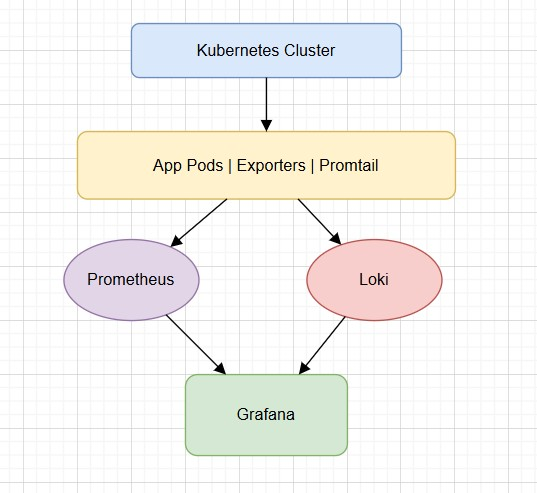

# 📊 Observability Stack: Prometheus + Grafana + Loki

---

## 🔍 Overview

This document explains how Prometheus, Grafana, and Loki work together to enable full observability in a Kubernetes environment. It also covers what is needed when new pods or nodes are added to the cluster.

---

## 🚦 The Observability Trio

### 1. Prometheus – Metrics Collector

* Scrapes metrics from applications and exporters via HTTP endpoints (usually `/metrics`).
* Stores time-series data (CPU, memory, HTTP requests, etc.).
* Pull-based model: Prometheus fetches data on its own.
* Supports alerting via rules and integrates with AlertManager.

### 2. Grafana – Dashboard & Visualization

* Connects to Prometheus, Loki, and other data sources.
* Builds visual dashboards with graphs and panels.
* Includes Explore view for ad-hoc queries.
* Supports alerting and threshold-based visualization.

### 3. Loki – Log Aggregator

* Collects logs from Kubernetes pods via Promtail or other agents.
* Uses the same labels as Kubernetes (e.g., `pod`, `namespace`, `container`).
* Allows querying logs using LogQL.
* Integrated directly with Grafana Explore tab.

---

## 🔗 How They Work Together



* Prometheus scrapes metrics from `/metrics` endpoints.
* Promtail reads logs and ships them to Loki.
* Grafana visualizes both metrics and logs from Prometheus and Loki.

---

## 🧪 What Happens When You Deploy New Things?

### ✅ New Pods

* If they expose `/metrics`, Prometheus can scrape them.
* You need to create a `ServiceMonitor` (if using Prometheus Operator):

```yaml
apiVersion: monitoring.coreos.com/v1
kind: ServiceMonitor
metadata:
  name: my-app-monitor
  labels:
    release: k8s-monitoring
spec:
  selector:
    matchLabels:
      app: my-app
  endpoints:
  - port: http-metrics
```

### ✅ New Nodes

* Node exporter is deployed as a DaemonSet → it auto-deploys to new nodes.
* Prometheus is already scraping node exporters by label.
* Grafana dashboards may auto-update, or you can manually adjust filters.

### ✅ New Applications

* Ensure app exposes Prometheus-formatted metrics.
* Use client libraries (Go, Python, Java, etc.) to instrument your code.
* Create ServiceMonitor to hook it into Prometheus.
* Add Grafana dashboards manually or use community templates.

### ✅ New Logs

* Promtail, deployed as DaemonSet, auto-discovers container logs.
* No manual configuration required unless you're filtering by label.

---

## 📘 Summary Table

| Resource Change | What to Do                                          |
| --------------- | --------------------------------------------------- |
| New Pod         | Create ServiceMonitor if metrics exposed            |
| New Node        | Nothing (node-exporter DaemonSet auto-applies)      |
| New Application | Expose /metrics + create ServiceMonitor + dashboard |
| New Log Source  | Promtail auto-picks pod logs                        |

---

## 🧠 Bonus Tips

* Use the Explore tab in Grafana to query logs (`{pod="your-pod"}`).
* Use dashboards like Node Exporter Full or Kubernetes Cluster Monitoring.
* Set up alerts in Prometheus or Grafana for key thresholds.

---

This setup forms a powerful and flexible observability system that scales with your Kubernetes cluster.
